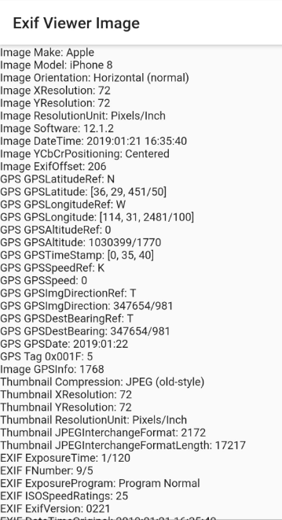

# exifApp
Image + Exif Viewer (techincal mini-project for human computer interaction course)

## Getting Started

#### Step 1: 
Download or clone this repo by using the link below:
```bash
https://github.com/Michi265/exifApp.git
```
#### Step 2: 
Go to project root and execute the following command in console to get the required dependencies:
```bash
flutter pub get 
```
#### Step 3:
```bash
flutter run 
```
### Prerequisites

To install flutter follow this link: https://flutter.dev/docs/get-started/install


